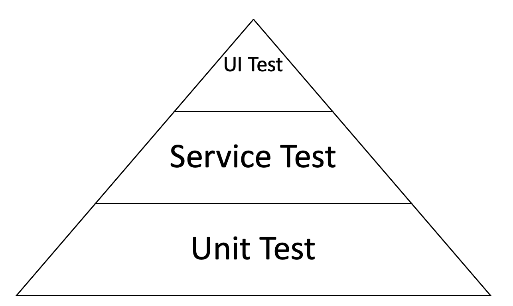
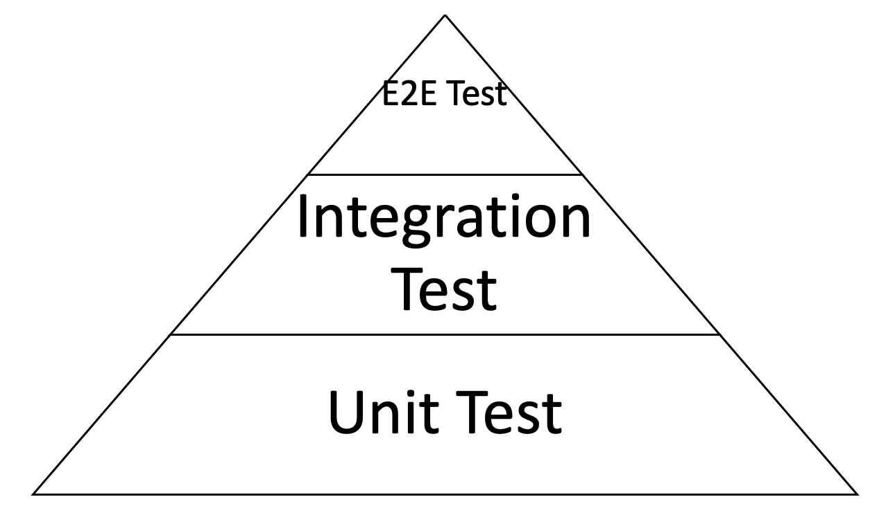
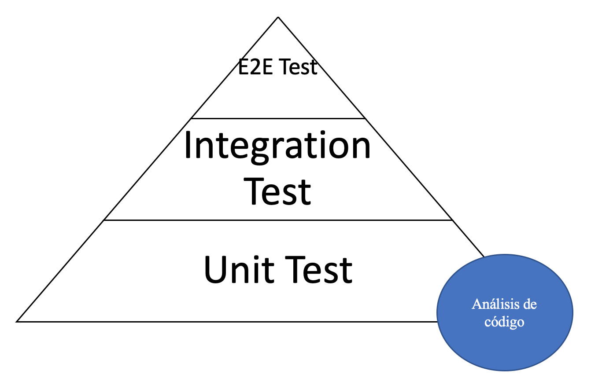

Vamos a definir los conceptos elementales sobre el testing en Javascript, así como su aplicación en código.

> Esto es una muestra del ebook Introducción al Testing en Javascript.

Vamos a revisar los siguientes temas:

- Primer acercamiento al testing automatizado.
- Herramientas de pruebas automatizadas para Javascript.
- Tipos de pruebas automatizadas.
- Tips para pruebas automatizadas.

En vez de aburrirte con un montón de teoría a secas, prefiero transmitirte conceptos abstractos por medio de ejemplos concretos que puedas aplicar en tu vida real y proyectos.

Definiremos los conceptos paso a paso y crearemos código que corresponda a dichos conceptos.

<div style="border-radius:5px;background-color:#242424; text-align:center; vertical-align: middle; padding:16px;color:#ffffff;margin: 32px 0px">
<p style="font-size:20px;">Esto forma parte del ebook
<a style="text-decoration: none;color:rgb(254, 243, 90);" target="_blank" rel="noopener noreferrer" href="https://amzn.to/3rr2lWN">Fundamentos de Testing en Javascript</a></p>
</div>


## Primer acercamiento al testing automatizado

Para darte un mejor contexto, cuando hablamos de testing en este libro, en realidad hablamos de testing automatizado.

¿Y qué es el **testing automatizado**? Es código que valida el funcionamiento de otro código de manera automática. Así de simple.

La prueba manual es la que realizamos cuando estamos desarrollando código y verificamos su correcto funcionamiento viendo el resultado final de la aplicación.

Por ejemplo, Si es frontend, vemos la UI en el navegador. Si es backend, vemos la respuesta de un api o los logs generados.

Las pruebas manuales requieren de tu valioso tiempo para probar si todo funciona bien. Si lo multiplicas por cada vez que hagas cambios y requieras validarlos, es mucho tiempo, muchas veces mayor tiempo que el que usamos para crear código.

Si dedicaras una fracción del tiempo que te toma hacer una prueba manual para hacer código que testee tu código, podrías delegar esa tarea a tu prueba automatizada y tener más tiempo libre para enfocarte en crear y aportar más valor al proyecto.

¿Pero cómo hacer testing automatizado?

Vamos a hacer el siguiente ejercicio como un ejemplo de testing automatizado.

Haz una función en Javascript que retorne la suma de dos números. Piensa en cómo harías la función.

Probablemente lo harías del siguiente modo:

```js
const sum = (a, b) => a + b

sum(1, 2) // 3
```

Bastante fácil, ¿eh? Ahora crea una nueva función que valide que la función de sum funcione correctamente.

Si el resultado es como el esperado, entonces que imprima en consola un mensaje de éxito.

Es importante que hagas el esfuerzo mental de pensar cómo harías código para resolver el problema de validar que tu función sum funcione exactamente como esperas.

A un nivel muy simple, esta es una posible solución:

```js
const sum = (a, b) => a + b

const validateSum = () => {
  const expected = 3

  const result = sum(1, 2)

  if (result === expected) {
    console.log("ok")
  }
}

validateSum() // ok
```

Para este punto, mi querido lector, estamos creando código que testea código.

No es el mejor, pero de acuerdo con la definición dada anteriormente, este código está testeando el correcto funcionamiento de la función sum dado los parámetros numéricos 1 y 2, por lo tanto, es testing automatizado.

Pero esta lección apenas comienza. Vamos a dar el siguiente paso de nivel de abstracción.

El código anterior funciona, pero estamos validando de manera “hardcodeada” el input de la función sum.

¿Cómo modificarías la implementación anterior para que pudiéramos hacer las pruebas de sum de modo que quede abierto y flexible a diferentes parámetros?

Probablemente pienses en algo parecido a lo siguiente:

```js
const sum = (a, b) => a + b

const validateSum = ({ a, b, expected }) => {
  const result = sum(a, b)

  if (result === expected) {
    console.log("ok")
  }
}

validateSum({ a: 3, b: 5, expected: 8 }) // ok
```

Esto también funciona, pero está muy acoplado a la interfaz de la función que estamos testeando.

Por ejemplo, ¿Cómo harías una función que, dado un número, retorne su valor a la tercera potencia o al cubo?

```js
const toCube = n => n * n * n

toCube(3) // 27
```

Nuestra función de validateSum ya no nos resulta útil para testear toCube.

¿Siguiendo la misma línea de pensamiento, crearías una función “validateToCube” para testearla?

¿Quiere decir que cada vez que quisieras testear una función, crearías una nueva función para testearla?

Es aquí donde requerimos dar el siguiente paso y abstraer aun mas. Y así es como han nacido las herramientas para testing automatizado.

Pero de momento hemos logrado el objetivo de tener un primer acercamiento con esta manera de hacer software.

No ha sido tan difícil. En mi opinión, a veces es mas divertido hacer los tests que la implementación final, ¡en serio!

¿Cuál es el modo profesional de hacer pruebas automatizadas? Vamos a explorar los tipos de herramientas que existen en el ecosistema en el siguiente apartado.

## Herramientas de pruebas automatizadas para Javascript

Existen una gran variedad de herramientas para pruebas automatizadas en el ecosistema de Javascript. Podemos categorizarlas de acuerdo con aquello en lo que se especializan.

A continuación, vamos a ver en lo que se especializa cada categoría, así como referencias a herramientas populares.

Algunas de estas herramientas se van a repetir porque son soluciones que integran más de una funcionalidad. Por ejemplo, varias incluyen Test runners, assertions y mocks.

### Corredor de pruebas (Test runner).

Se especializan en ejecutar flujos de tests.

Puedes configurar el tipo de entorno donde correrán las pruebas, así como extender la funcionalidad de Javascript por medio de babel.

Ejemplos populares: Jest, Jasmine, Cypress.

Por lo común, lucen del siguiente modo:

```js
// math.test.js

describe("maths", () => {
  it("sum", () => {
    // test code here...
  })

  it("cube", () => {
    // test code here...
  })
})
```

Donde “describe” e “it”, son funciones globales que expone la herramienta al momento de ejecutar la prueba.

Son muy útiles para agrupar y describir casos de pruebas.

En este ejemplo, estamos haciendo el flujo para testear operaciones matemáticas como en la sección anterior.

### Pruebas de afirmaciones (Assertions tests).

Son usadas para validar si una función o módulo retorna lo que esperas que retorne. Esto es muy parecido a lo que vimos en el ejercicio de la sección sobre el primer acercamiento a las pruebas automatizadas.

Ejemplos populares: Jest, Chai, Jasmine, Cypress. TestCafe.
Cada herramienta tiene su propia sintaxis, pero en esencia validan los mismos casos de uso.

Ejemplo:

```js
expect(sum(1, 2)).toEqual(3)

expect(cube(3)).toEqual(27)
```

### Simuladores y Falseadores (Mocks, spies and stubes).

Nos permiten probar código de manera aislada e independiente de las dependencias que pueda tener.

Estas herramientas nos permiten reemplazar las dependencias por objetos que simulan funcionar como si fueran las dependencias reales, pero no lo son realmente.

No te preocupes si te suena confuso. De momento basta conque tengas esta idea en mente.

Cubrimos este tema de mocks a mayor profundidad en su capitulo correspondiente.

Ejemplos populares: Sinon, Jest, Karma.

Para mostrarte un ejemplo de cómo lucen, vamos a asumir que tenemos un api hecho con node y tenemos una dependencia para obtener valores de un servicio externo.

```js
// my-user-service.js
const myUserService = () => {
  // internal implementation, example: DB query
}

// api.js
const myUserService = require("./my-user-service")

console.log(myUserService) // function

api.get("/users", (req, res) => {
  const users = myUserService()

  return res.status(200).json({ users })
})
```

Y en la prueba:

```js
// api.test.js
const myUserService = require("./my-user-service")

jest.mock("./myUserService") // Jest replace original function with a mock

console.log(myUserService) // mock function
```

Probablemente no haga mucho sentido ahorita. Una utilidad para este ejemplo sería validar si myUserService fue ejecutado una vez (assert), o manipular lo que queramos que retorne.

Como dije antes, veremos este tema en profundidad en su capítulo correspondiente.

### Cobertura de código (Code coverage).

Estas herramientas nos crean un reporte que nos indica cuánto de nuestro código ha sido cubierto por nuestras pruebas automatizadas.

La cobertura de código nos sirve para tener una medición de cuantos escenarios posibles han sido cubiertos por nuestros tests.

Incluso hay equipos de trabajo en los que un requerimiento de calidad es tener cierto porcentaje del código cubierto por pruebas, yendo desde un equilibrado 70% hasta un extremo de 100% (no recomendable).

Ejemplos populares: Istanbul, Jest


Fuente de la imagen: [jest.io](https://jestjs.io/en/)

### Control de navegador (Browser controller).

Corren pruebas automatizadas de la manera más cercana posible a como si fuera un usuario real quien prueba la aplicación.

Para darte un ejemplo, este tipo de herramientas pueden abrir la aplicación web en un navegador real y de manera automática realizar eventos como escribir valores en un formulario, dar clics en botones y demás.

Lo mejor de todo es que puedes presenciar la ejecución de dichas operaciones tal y como si de un robot se tratara.

Personalmente, estas herramientas se me hacen las más interesantes.

Ejemplos populares: Cypress, Nightwatch.

## Resumen de herramientas para pruebas automatizadas

Como puedes ver, el ecosistema de Javascript es enorme y hay muchas herramientas a elegir. Y eso que aquí vimos sólo las más populares. Pero no te preocupes, no tienes que aprenderlas todas.

Estas herramientas son sólo eso, herramientas. No proveen por sí mismas del criterio y diseño para hacer las pruebas.

Lo importante es comprender la esencia de cómo diseñar e implementar pruebas automatizadas de calidad. Y es justo lo que estás aprendiendo en este libro.

Ahora la pregunta es entonces: Teniendo en cuenta estas herramientas, ¿Por dónde empiezo? ¿Cómo diseño las pruebas?

En la siguiente sección vamos a responder estas preguntas conociendo los tipos de pruebas que podemos realizar.

## Tipos de pruebas automatizadas

Existe un concepto muy popular en la industria que clasifica a las pruebas automatizadas en base al alcance del código que están probando: La pirámide de pruebas (test pyramid).


Pirámide de pruebas por Mike Cohn.

**Mike Cohn** mostró este concepto en su libro **Succeeding with agile** que en su tiempo hacía sentido, y a pesar de que actualmente la industria de software ha madurado, sigue siendo una referencia por la idea que nos transmite.

Esta pirámide consiste en los siguientes elementos.

**Unit Test.** Probar un elemento individual del software. Por ejemplo, una función o un método de una clase.

De acuerdo con esta pirámide, son la base debido a que son los más rápidos de crear, ejecutar y nos proveen de información muy específica de en qué punto de nuestro código hay un error (error en la línea 120 del archivo tal, por ejemplo).

**Service Test.** Consiste en probar los servicios de una aplicación por separado de su interfaz de usuario. Un ejemplo de servicio puede ser en un flujo de la aplicación. Obtener el total a pagar de un carrito de compras por dar un ejemplo concreto.

**UI Test.** Es referente a la interfaz de usuario. En una aplicación, la interfaz de usuario involucra todo el software funcionando en su totalidad.

A pesar de que esta pirámide no representa de manera fidedigna el estado del arte en el testing de Javascript actual, sí nos ayudó a establecer las siguientes premisas:

- Escribir tests en diferente granularidad.
- Delimitar la cantidad de tests de acuerdo con el costo – beneficio según su nivel de granularidad.

Con base a lo anterior, nosotros podemos diseñar nuestras pruebas con un enfoque parecido.

La manera en que comúnmente se maneja en la industria es:



Donde:

**Unit Test.** Sigue siendo el mismo concepto manejado en la pirámide de Cohn. Consiste en hacer pruebas de elementos individuales e independientes de nuestro código.

**Integration Test.** Los tests de integración consisten en probar un conjunto de elementos individuales. Por ejemplo, la interacción de un grupo de funciones o clases que funcionan en conjunto para una funcionalidad.

**E2E (end to end) Test.** También llamados “functional testing” son aquellos que prueban toda una aplicación en su conjunto desde inicio a fin. Valida que todo el software

funcione como se espera. Estos tests suelen ser creados por ingenieros de Quality Assurance (QA).

Ya que el propósito de los tests automatizados es asegurar el correcto funcionamiento de nuestro código, existe una técnica adicional que podemos implementar: **Análisis de código.**

Un ejemplo de análisis de código es, por ejemplo, cuando estamos haciendo referencia a una variable que no está definida.

Ya que Javascript es un lenguaje dinámico y se interpreta en tiempo de ejecución, este tipo de errores los observamos hasta cuando nuestro código está siendo ejecutado en la aplicación.

Afortunadamente, existen muchas herramientas de análisis de código que podemos usar en nuestro código de Javascript y que complementan nuestras pruebas automatizadas.

En este caso, una herramienta de análisis de código nos puede alertar que en la línea N del archivo tal, estamos usando una variable que no está definida.

Nuestros tipos de tests pueden quedar del siguiente modo:



Vamos a ver ejemplos de código muy a profundidad paso a paso en los siguientes capítulos con diferentes herramientas.

<div style="border-radius:5px;background-color:#242424; text-align:center; vertical-align: middle; padding:16px;color:#ffffff;margin: 32px 0px">
<p style="font-size:20px;">Esto forma parte del ebook
<a style="text-decoration: none;color:rgb(254, 243, 90);" target="_blank" rel="noopener noreferrer" href="https://amzn.to/3rr2lWN">Fundamentos de Testing en Javascript</a></p>
</div>
